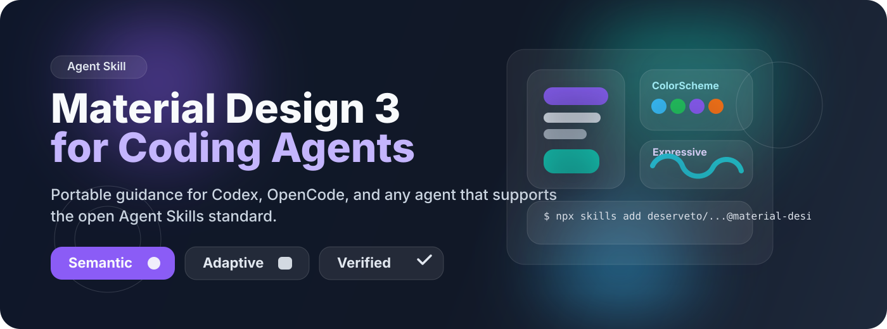
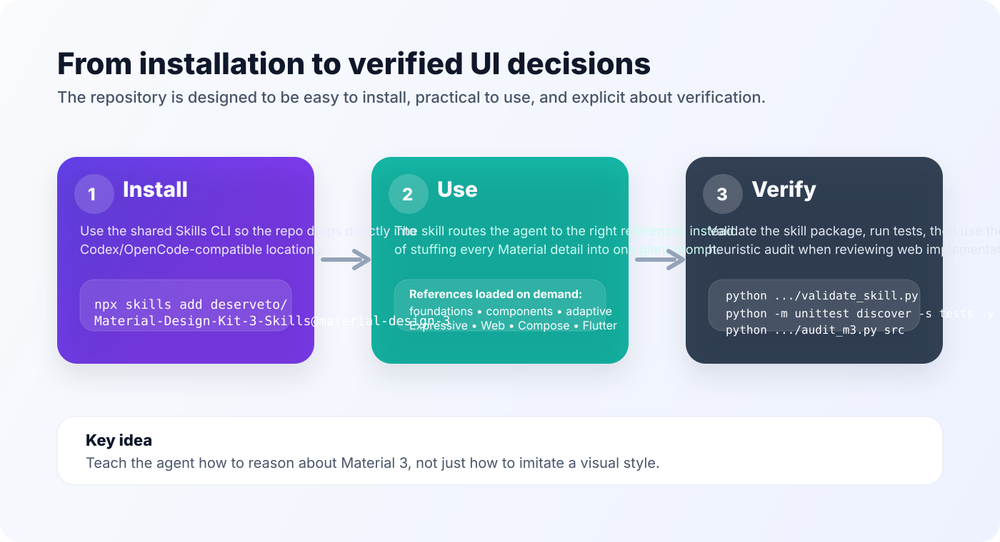

<p align="center">
  
</p>

<h1 align="center">Material Design 3 Skill</h1>

<p align="center">
  A portable <strong>Agent Skill</strong> for <strong>Material Design 3</strong>, <strong>Material You</strong>, and <strong>Material 3 Expressive</strong>.
  <br />
  Built for coding agents such as <strong>Codex</strong> and <strong>OpenCode</strong>, with one canonical skill source under <code>.agents/skills/</code>.
</p>

<p align="center">
  <a href="https://github.com/deserveto/Material-Design-Kit-3-Skills"></a>
  
  
  
</p>

<p align="center">
  <a href="#quick-install">Quick install</a>
  ·
  <a href="#what-you-get">What you get</a>
  ·
  <a href="#usage">Usage</a>
  ·
  <a href="#validation-and-audit">Validation</a>
  ·
  <a href="#repository-structure">Structure</a>
</p>

---

## Why this exists

Most "Material Design" prompts teach a **look**:

- purple everywhere,
- round cards,
- oversized radii,
- lots of shadows.

This repository teaches an agent a **system** instead:

- semantic design tokens and color roles;
- typography, shape, motion, elevation, and Material Symbols;
- component choice by interaction semantics and hierarchy;
- adaptive layouts rather than stretched phone screens;
- accessibility and complete interaction states;
- Material 3 Expressive with restraint;
- platform-specific implementation differences;
- stable versus alpha/experimental API boundaries;
- deterministic and rendered verification.

It is an **unofficial community project** and is **not affiliated with or endorsed by Google**.

---

## Quick install

The easiest path is through the shared **`skills` CLI** ecosystem.

### Install for the current project

```bash
npx skills add deserveto/Material-Design-Kit-3-Skills@material-design-3
```

### Install for Codex

```bash
npx skills add deserveto/Material-Design-Kit-3-Skills@material-design-3 \
  --agent codex \
  --yes
```

### Install for OpenCode

```bash
npx skills add deserveto/Material-Design-Kit-3-Skills@material-design-3 \
  --agent opencode \
  --yes
```

### Install globally

```bash
npx skills add deserveto/Material-Design-Kit-3-Skills@material-design-3 \
  --global \
  --yes
```

### Install for multiple agents

```bash
npx skills add deserveto/Material-Design-Kit-3-Skills@material-design-3 \
  --agent codex \
  --agent opencode \
  --yes
```

> The canonical skill name is **`material-design-3`**.

---

## Demo workflow

<p align="center">
  
</p>

### Typical flow

1. Install the skill with `npx skills add ...`
2. Ask your coding agent to build or review an interface using Material 3
3. Let the skill route the agent to the right references:
   - foundations,
   - components,
   - accessibility/adaptive layout,
   - Expressive,
   - Web / Compose / Flutter
4. Run project verification plus the included Material audit helper when useful
5. Review the rendered result, not just the source code

---

## What you get

| Area | What it gives the agent |
|---|---|
| **Core skill** | Lean `SKILL.md` with progressive-disclosure routing |
| **Foundations** | Semantic tokens, color, motion, elevation, and icons |
| **Typography guide** | Full 15-role baseline scale, custom-font mapping, scaling, and platform translation |
| **Shape guide** | Corner scale, Compose baseline values, newer alpha slots, and all 35 experimental MaterialShapes |
| **Components** | Prominence, semantics, and common M3 anti-pattern avoidance |
| **Adaptive + accessibility** | Window-size thinking, navigation adaptation, keyboard/focus, touch targets, contrast, scaling |
| **Expressive** | Material 3 Expressive guidance with clear restraint rules |
| **Platform profiles** | Web, Jetpack Compose, and Flutter implementation guidance |
| **Validator** | Checks the skill package contract and reference integrity |
| **Audit helper** | Conservative static review for common web-side M3 issues |
| **Behavioral evals** | Test cases for control-vs-skill evaluation across real agent runs |

---

## Usage

### When to use this skill

Use it when a task is explicitly about:

- creating a new Material 3 UI,
- extending an existing Material 3 application,
- migrating from Material 2 / legacy patterns,
- reviewing a UI for Material 3 alignment,
- applying Material 3 Expressive carefully,
- implementing M3 on Web, Compose, or Flutter.

### What the skill will deliberately avoid

This skill tries to stop agents from doing things like:

- forcing Material into a repo that uses another design system,
- translating Compose APIs literally into web code,
- hard-coding reference purple everywhere,
- wrapping every section in cards,
- overusing FABs, chips, and shadows,
- stretching phone navigation patterns onto wide layouts,
- silently using experimental APIs as if they were stable.

---

## Validation and audit

### Validate the skill package

```bash
python .agents/skills/material-design-3/scripts/validate_skill.py
```

### Run the repository test suite

```bash
python -m unittest discover -s tests -v
```

### Run the heuristic Material audit for a web project

```bash
python .agents/skills/material-design-3/scripts/audit_m3.py src
```

### JSON output

```bash
python .agents/skills/material-design-3/scripts/audit_m3.py --json src
```

> A clean audit is **not** Material compliance or accessibility certification. It is a conservative reviewer/agent aid.

---

## Behavioral evals

The repository includes a small eval corpus for fresh-session testing with and without the skill.

Covered scenarios include:

- new M3 UI generation,
- preserving non-Material existing systems,
- M2/legacy migration,
- semantic color role usage,
- adaptive list-detail behavior,
- touch target and icon semantics,
- Material 3 Expressive restraint,
- Compose stable vs experimental API boundaries,
- Flutter migration,
- visual verification behavior.

See:

```text
.agents/skills/material-design-3/evals/
```

---

## Current platform snapshot

At the current research snapshot (**reviewed 2026-08-24**):

- Google's Material site presents **M3 Expressive** as the current evolution of Material 3.
- The Figma M3 Design Kit is positioned as updated for Expressive.
- AndroidX Compose Material3 has a split between **stable** and **alpha/experimental** Expressive-related APIs.
- Flutter has used Material 3 by default since Flutter 3.16, but migration can still require real component changes.

Version-sensitive facts are recorded separately from stable concepts so the agent does not confuse:

```text
official Material guidance
!=
stable API everywhere
```

Primary sources and review dates are pinned in:

```text
.agents/skills/material-design-3/references/sources.md
```

---

## Repository structure

```text
.agents/skills/material-design-3/
├── SKILL.md
├── agents/
│   └── openai.yaml
├── evals/
│   ├── README.md
│   └── cases.json
├── references/
│   ├── adaptive-accessibility.md
│   ├── components.md
│   ├── expressive.md
│   ├── foundations.md
│   ├── typography.md
│   ├── shape.md
│   ├── platform-compose.md
│   ├── platform-flutter.md
│   ├── platform-web.md
│   └── sources.md
├── assets/
│   ├── typography-baseline.json
│   └── shape-baseline.json
└── scripts/
    ├── audit_m3.py
    └── validate_skill.py

adapters/
├── codex/
│   └── AGENTS.md.example
└── opencode/
    ├── AGENTS.md.example
    └── opencode.jsonc.example

tests/
.github/workflows/
docs/
assets/
```

---

## Manual install fallback

If you do not want to use `npx skills`, you can still copy the skill manually:

```bash
mkdir -p .agents/skills
cp -R /path/to/Material-Design-Kit-3-Skills/.agents/skills/material-design-3 .agents/skills/
```

For user-global installation, place it in:

```text
~/.agents/skills/material-design-3/
```

---

## Roadmap

Possible later work:

- broader static audit rules with tighter false-positive controls;
- fixture repositories and automated agent behavior matrices;
- richer rendered demo examples;
- Figma-assisted workflows;
- plugin packaging for wider distribution;
- more platform profiles where Material implementations are maintained.

The canonical Material knowledge should remain in the **Agent Skill**, even if plugins are added later.

---

## License

This repository is released under the **MIT License** for repository-authored content.

Material Design, Material You, Material Symbols, Android, Flutter, Google, and related names/trademarks belong to their respective owners. External source material remains under its original terms.
